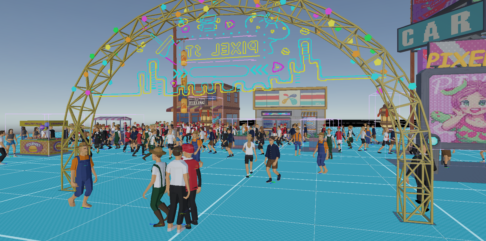

# Project Festival

English README: [README_EN.md](README_EN.md)

## 项目简介

`Project Festival` 是一个基于 Unity 的 3D 节庆经营模拟项目。  
玩家通过放置建筑、管理资金与满意度、解锁区域与建筑，逐步提升活动规模。



## 核心玩法

- 网格化建造：建筑按网格放置，支持可建造性检测与实时放置指示器。
- 经营系统：游客交互会带来资金与满意度变化，资金不足会触发救济对话事件。
- 进阶解锁：满意度达到阈值后提升等级，解锁新建筑与新地图区域。
- 地图可视化：支持网格视图、占用视图、拥挤度/路径视图切换。
- 游客 AI：使用 `NavMesh + Context Steering + FSM` 实现寻路、游走、互动与离场流程。
- 数据驱动 UI：Panel + Data 绑定，UI 与 Gameplay 通过事件总线解耦。

## 技术栈

- Unity `6000.3.6f1` (Unity 6.3 LTS)
- URP（`com.unity.render-pipelines.universal`）
- Input System（`com.unity.inputsystem`）
- AI Navigation（`com.unity.ai.navigation`）
- TextMeshPro / UGUI

## 快速开始

1. 使用 Unity Hub 打开本项目（推荐 Editor 版本：`6000.2.8f1`）。
2. 打开场景 `Assets/Scenes/0.unity`。
3. 点击 Play 运行，主菜单点击 `Start` 进入游戏。

## 操作说明（键鼠）

- `W/A/S/D` 或方向键：移动镜头
- `Q/E`：旋转镜头
- 鼠标滚轮：缩放镜头
- 左键点击建筑卡片后，再左键点击地面：放置建筑
- 右键：取消当前建筑放置
- `ESC`：打开设置面板
- 对话框出现后，点击对话区域继续

## 项目结构

```text
Assets/
  Scripts/
    Tool/       # 通用工具层（单例、状态机、响应式数据等）
    Core/       # 核心层（输入、音乐、全局事件、基础数据）
    GamePlay/   # 玩法层（建造、网格、区域、数值、AI、相机）
    UI/         # 表现层（Panel、UI 管理、AutoUIBinder）
  Data/         # ScriptableObject 配置（建筑、对话等）
  Resources/    # 运行时加载资源（UI 预制体、音频）
  Scenes/       # 场景（0: Main Menu, 1: In-Game）
```

## 程序架构（Assembly）

- `Tool`：基础工具，不依赖其他项目程序集
- `Core`：依赖 `Tool`，提供输入/音乐/事件与共享数据
- `GamePlay`：依赖 `Tool` + `Core`，实现主要游戏逻辑
- `UI`：依赖 `Tool` + `Core`，实现界面和 UI 交互

## 资源与致谢

- Context Steering 思路参考：Game AI Pro 2 Chapter 18
- 部分模型与素材来自公开资源平台（如 Unity Asset Store、PolyPerfect 等）
